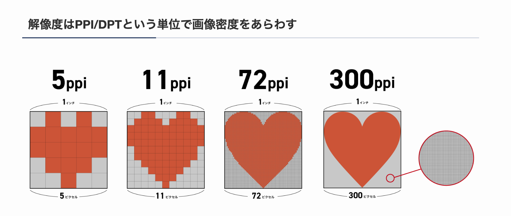

# 入出力装置とDPI・3Dプリンターについて

## 1. 入力装置とは？
**入力装置**とは、コンピュータにデータを入力するための装置のことです。  
ユーザーが指示を与えたり、情報を入力する際に使用されます。

### **主な入力装置**
| 装置名 | 用途 |
|------|------|
| **キーボード** | 文字やコマンドを入力 |
| **マウス** | ポインタ操作、クリックやスクロール |
| **タッチパネル** | 指やペンで直接操作 |
| **ゲームコントローラー** | ゲームの操作用 |
| **スキャナー** | 画像や文書をデジタルデータに変換 |
| **マイク** | 音声入力（音声認識、通話など） |
| **カメラ** | 画像・動画の入力 |

---

## 2. 出力装置とは？
**出力装置**とは、コンピュータが処理した結果を表示するための装置です。  
文字や画像、音声などの形で情報をユーザーに伝えます。

### **主な出力装置**
| 装置名 | 用途 |
|------|------|
| **ディスプレイ** | 画面に画像や動画を表示 |
| **プリンター** | 文書や写真を紙に印刷 |
| **スピーカー** | 音楽や音声を再生 |
| **プロジェクター** | 大画面に映像を投影 |

---

## 3. ディスプレイとは？
ディスプレイは、コンピュータが処理した結果（画像や動画など）を表示する装置です。  
ディスプレイ上の表示は、**細かいマス目（ピクセル）**で構成されています。

### **ピクセル（ドット）とは？**
- ディスプレイは、人間の目には識別できないほど小さな**マス（ピクセル/ドット）**で区切られています。
- それぞれのマスが色を発色することで、文字や画像が表現されます。

### **ディスプレイの解像度**
解像度は、**画面上のピクセル数**を示します。  
解像度が高いほど、より細かく鮮明な表示が可能です。

| 解像度 | ピクセル数（横×縦） |
|------|----------------|
| **HD** | 1280 × 720 |
| **Full HD（FHD）** | 1920 × 1080 |
| **4K UHD** | 3840 × 2160 |
| **8K UHD** | 7680 × 4320 |

---

## 4. DPI（Dots Per Inch）とは？
**DPI**（ドット・パー・インチ）は、**1インチ（2.54cm）内に含まれるドットの数**を表す単位です。  
**ディスプレイやプリンターの解像度を示す指標**として使われます。

### **DPIの考え方**
- **1インチ = 2.54cm**
- **300DPI** → 1インチ（2.54cm）内に**300個のドット**が並んでいる
- **600DPI** → 1インチ内に**600個のドット**が並んでいる

### **DPIの重要なポイント**
✅ **DPIは「1インチ四方のドット数」ではなく、「1インチの長さに並ぶドット数」**  
✅ DPIが高いほど、より細かく滑らかな表示や印刷が可能  
✅ ディスプレイではDPIではなく**PPI（Pixels Per Inch）**が使われることが多い  

### **用途別のDPI目安**
| 用途 | 推奨DPI |
|------|--------|
| **ディスプレイ（PC・スマホ）** | 72〜400 PPI |
| **印刷用画像（写真・ポスター）** | 300 DPI 以上 |
| **新聞印刷** | 100〜150 DPI |
| **高品質印刷（写真集・雑誌）** | 600 DPI 以上 |

---

## 5. ポイント（pt）とは？
**ポイント（pt）**は、**文字の大きさを表す単位**です。

### **ポイントの基本**
- **1ポイント（pt） = 1/72インチ ≈ 0.35mm**
- **12ポイント = 12/72インチ ≈ 4.2mm**

### **ポイントとフォントサイズの関係**
- 12ポイントの文字が正方形ならば、**縦・横 約4.2mmのサイズ**になる。
- 一般的な文書では**10pt〜12pt**のフォントサイズがよく使われる。

---

## 6. 3Dプリンターとは？
**3Dプリンター**は、**3次元のデータを基に立体物を造形する機械**です。  
通常、**樹脂や金属を積み重ねる**ことで物体を形成します。

### **3Dプリンターの用途**
- **試作品の製作**（プロトタイピング）
- **医療（義手・人工骨の作成）**
- **建築模型の作成**
- **自動車部品の製造**
- **ホビー・フィギュア制作**

---

## 7. 3Dプリンターの出力方式
### **① 熱溶解積層方式（FDM：Fused Deposition Modeling）**
- **熱で溶かした樹脂を積み重ねる方式**
- **家庭用3Dプリンターで一般的**
- **材料：PLA、ABSなどの樹脂**
- **メリット：安価で扱いやすい**
- **デメリット：表面が粗くなることがある**

### **② 光造形方式（SLA/DLP：Stereolithography）**
- **液体状の樹脂（レジン）に紫外線を照射して固める方式**
- **高精度の造形が可能**
- **材料：光硬化性樹脂**
- **メリット：細かい造形ができる**
- **デメリット：専用の樹脂が必要で、後処理も手間がかかる**

### **③ 粉末固着方式（SLS：Selective Laser Sintering）**
- **粉末状の素材にレーザーや接着剤を使って固める方式**
- **金属3Dプリンターにも使われる**
- **材料：ナイロン、金属粉末など**
- **メリット：強度が高い造形が可能**
- **デメリット：高価で大型の機械が必要**

---

## **8. まとめ**
| 分類 | 説明 |
|------|------|
| **入力装置** | PCにデータを入力する装置（キーボード、マウスなど） |
| **出力装置** | PCの処理結果を表示する装置（ディスプレイ、プリンターなど） |
| **ディスプレイ** | ピクセルの集合体で画像や動画を表示 |
| **DPI** | 1インチに含まれるドットの数（印刷やディスプレイの解像度） |
| **ポイント（pt）** | 文字サイズの単位（1pt = 1/72インチ） |
| **3Dプリンター** | 立体物を造形する装置（熱溶解積層方式、光造形方式、粉末固着方式） |

