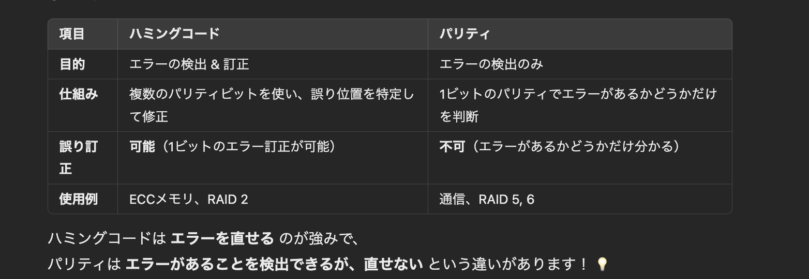

# システムの構成による分類

システムを **システム構成** で分類すると、主に以下の3つに分けられる。

## 1. シンプレックスシステム
- **概要**  
  1台のコンピュータのみで構成される、最もシンプルなシステム。
- **特徴**
  - 構成が単純でコストが低い。
  - 1つのコンピュータが故障すると、システムが完全に停止する。

---

## 2. デュプレックスシステム
- **概要**  
  メインのコンピュータ（**現用系**）とは別に、故障に備えた **待機系** のコンピュータを持つシステム。
- **特徴**
  - **待機系があるため、故障時にシステムを継続できる。**
  - 通常は **ホットスタンバイ** または **コールドスタンバイ** の方式を取る。
  
### ホットスタンバイ
- **待機系にも常に電源を入れておき、現用系と同じデータやプログラムを保持する方式。**
- **障害発生時に即座に切り替え可能。**
  
### コールドスタンバイ
- **待機系は電源を入れずに停止状態で待機。**
- **障害発生時に手動で起動し切り替える。運用コストが低いが、復旧に時間がかかる。**

---

## 3. デュアルシステム
- **概要**  
  2台のコンピュータが常に **同じ処理** を行い、結果を照合することで処理の正確性を確認するシステム。
- **特徴**
  - **信頼性が高いが、処理能力はシンプレックスシステムとほぼ同じ。**
  - **計算結果をチェックするため、ミッションクリティカルなシステムで利用される。**

---

# システムの信頼性と耐障害設計

## 信頼性
システムが障害にどれだけ強いかを示す指標。

**システムの信頼性を高めるための設計手法**  
1. **フォールトトレラント（Fault Tolerant）**
   - システムが一部故障しても、全体として必要な機能を維持する設計。
   - **フォールトトレラントシステム** では、冗長構成（バックアップシステムなど）が用いられる。

2. **フェールソフト（Fail Soft）**
   - 一部の機能を制限しながら、システム全体を動作させる設計。
   - 例: 飛行機のエンジンが一部故障しても飛行を継続。

3. **フェールセーフ（Fail Safe）**
   - システム障害時には **安全を優先** してシステムを停止させる設計。
   - 例: 工場の機械が異常を検知すると自動停止。

4. **フールプルーフ（Fail Proof）**
   - 人間が誤った操作をしても、システムが異常を起こさないようにする設計。
   - 例: 電子レンジはドアを閉めないと加熱できない。

---

# RAID（Redundant Array of Independent Disks）

**RAID（レイド）** とは、複数のハードディスクを組み合わせて、信頼性や性能を向上させる技術。

## RAID の種類

| RAID レベル | 記憶方式 | 特徴 |
|------------|----------|------|
| **RAID 0** | **ストライピング** | データを複数のディスクに分散して書き込む。 高速だが、信頼性は低い。 |
| **RAID 1** | **ミラーリング** | 同じデータを複数のディスクに書き込む。 信頼性が高いが、容量効率が低い。 |
| **RAID 2** | **ハミングコード** | エラー訂正符号を追加し、データを分散。 |
| **RAID 3** | **専用ディスクで誤り訂正** | 1つのディスクに誤り訂正符号を書き込み、他のディスクにデータを保存。 |
| **RAID 4** | **ブロック単位で誤り訂正** | RAID3と同様だが、データをブロック単位で分割。 |
| **RAID 5** | **パリティ付きストライピング** | データと誤り訂正情報（パリティ）を分散して書き込む。 |
| **RAID 6** | **二重パリティ** | RAID5のパリティを2重にして、より高い信頼性を確保。 |

---

## RAID 0（ストライピング）
- **データを複数のハードディスクに分散させて書き込む記憶方式。**
- **メリット**: 読み書きの速度が向上。
- **デメリット**: 1つのディスクが故障すると全データが失われる。

---

## RAID 1（ミラーリング）
- **同じデータを複数のハードディスクに書き込む記憶方式。**
- **メリット**: ディスクが故障してもデータを復旧可能。
- **デメリット**: ディスクの使用効率が低く、コストが高い。

---

# まとめ

- **システムの構成**
  - **シンプレックスシステム**: 1台のコンピュータのみ。シンプルだが障害に弱い。
  - **デュプレックスシステム**: メイン機 + 待機機（ホットスタンバイ or コールドスタンバイ）。
  - **デュアルシステム**: 2台のコンピュータが同じ処理を行い、結果を照合。

- **システムの信頼性**
  - **フォールトトレラント**: 障害時もシステムを維持する設計。
  - **フェールソフト**: 一部の機能が制限されても動作を継続。
  - **フェールセーフ**: 安全を優先し、システムを停止。
  - **フールプルーフ**: ユーザのミスを防ぐ設計。

- **RAID（ハードディスクの構成）**
  - **RAID 0（ストライピング）**: 高速だが、信頼性は低い。
  - **RAID 1（ミラーリング）**: 信頼性は高いが、コストが高い。
  - **RAID 5, 6**: パリティを利用して信頼性を向上。

**RAID やデュプレックスシステムを活用することで、システムの信頼性を向上させることが可能である。**
